# Git软件安装使用教程

## 1 安装Git

> 一切从这里开始 [官方下载地址](https://git-scm.com/downloads)


## 2 配置 ssh-key

> Git使用`ssh/https`两种协议，关联`ssh-key`并使用`ssh协议`可以免去每次都输密码的麻烦
>
> 参考Git官方帮助文档：[生成 SSH 公钥](https://git-scm.com/book/zh/v2/%E6%9C%8D%E5%8A%A1%E5%99%A8%E4%B8%8A%E7%9A%84-Git-%E7%94%9F%E6%88%90-SSH-%E5%85%AC%E9%92%A5)

### 2.1 判断是否已有ssh-key

> 默认情况下，用户的 `ssh-key`存储在其 `~/.ssh` 目录

```bash
cd ~/.ssh
ls
```

如图所示，已有ssh-key

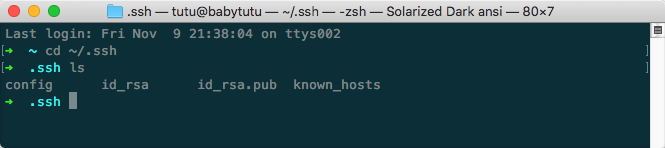


### 2.2 生成新的ssh-key

> 没有`ssh-key`

```bash
ssh-keygen
```

首先 `ssh-keygen` 会确认密钥的存储位置（默认是 `.ssh/id_rsa`），然后它会要求你输入两次密钥口令。如果你不想在使用密钥时输入口令，将其留空即可。


###  2.3 将ssh-key关联到GitHub/GitLab

> 复制已有的`ssh-key`，添加到账户设置的`ssh-key`配置项中

```bash
cat ~/.ssh/id_rsa.pub
```

公钥看起来是这样的

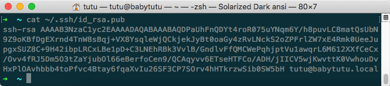


### 2.4 验证ssh-key关联状态

>以GitHub为例,图中为设置成功的返回结果

```bash
ssh -T git@github.com
```

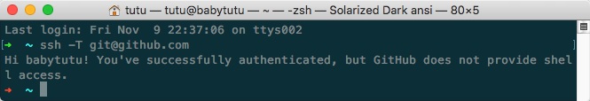


## 3 安装Sourcetree

> 免费的Git客户端  [官方下载地址](https://www.sourcetreeapp.com)


安装完成
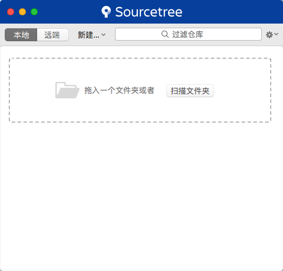

## 4 Sourcetree简明使用指南

### 4.1 基础配置

#### 4.1.1 账户信息

- 填写默认用户信息，commit记录中会显示
- 选择项目目录，语言等

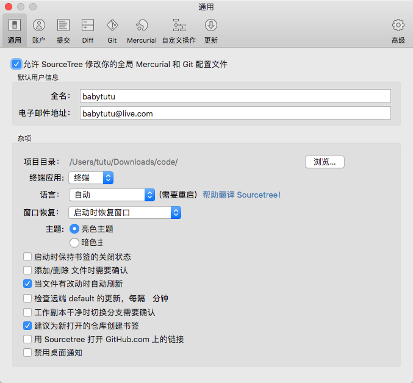

#### 4.1.2 功能区域

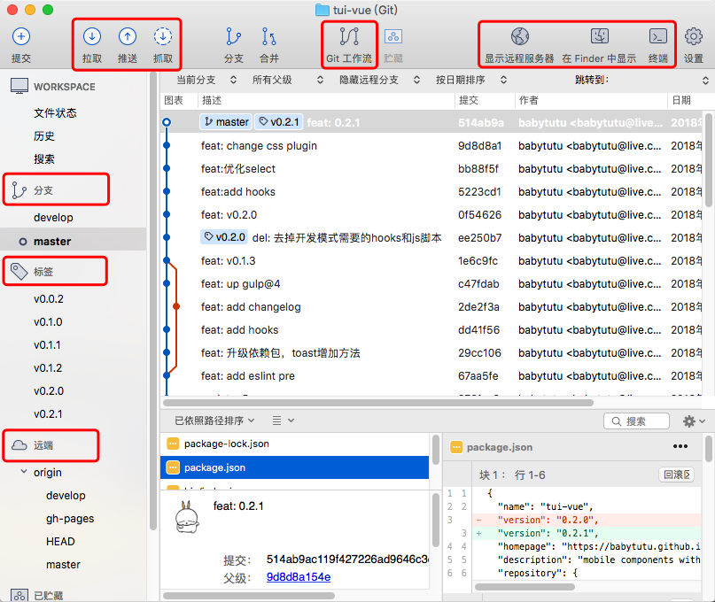


### 4.2 新建/克隆仓库

Sourcetree提供若干添加仓库的方式

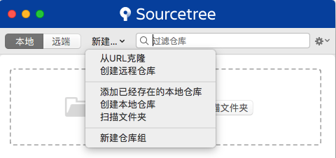

#### 4.2.1 扫描文件夹

从小乌龟等其他git管理工具快速迁移到`Sourcetree`的大招

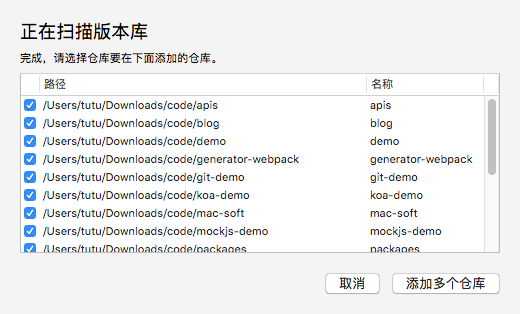


#### 4.2.2 从URL克隆

> 已配置并成功测试`ssh-key`后，请复制`ssh`开头的远程仓库地址

最常见的方式，从gitlab中拷贝地址，可以通过`高级选项-检出分支`来选择分支，git仓库缺省分支一般是master，而开发使用feature或者develop

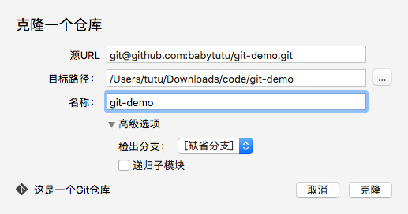

添加成功后，列表中会显示仓库名称

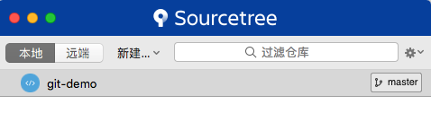

双击仓库名查看仓库详情


#### 4.2.3 添加已经存在的本地仓库

如果只想把单独的本地仓库放到Sourcetree中管理，可以使用这个操作


#### 4.2.4 创建本地仓库

把本地文件夹变成一个本地仓库，可以通过关联远程仓库把本地仓库内容推送到远程仓库

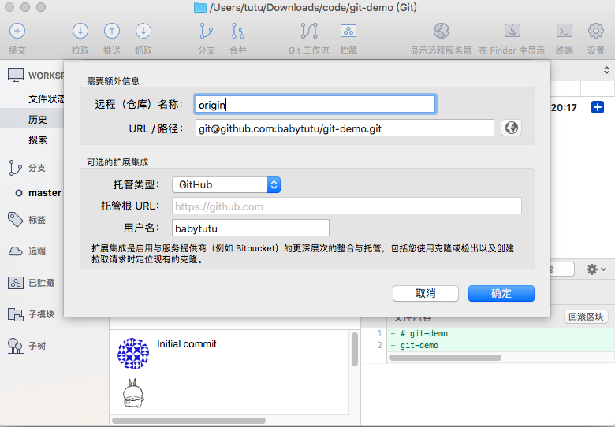


### 4.3 分支管理【Git-flow】

| 分支命名规则 | 功能         | 备注                        |
| ------------ | ------------ | --------------------------- |
| feature      | 功能分支     | 功能开发，每次从develop新建 |
| develop      | 开发分支     | 功能开发完毕后合并到此分支  |
| release      | 发布分支     | 从develop新建，发布tag      |
| hotfix       | 补丁分支     | 修复紧急bug                 |
| master       | 生产环境分支 | 用于记录发布版本            |

#### 4.3.1 初始化

> 新仓库先执行`Git工作流`，为分支设置前缀

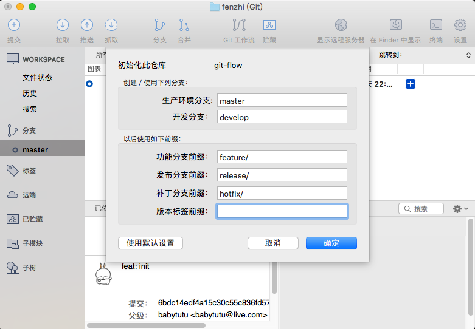

Git flow的几个基本操作

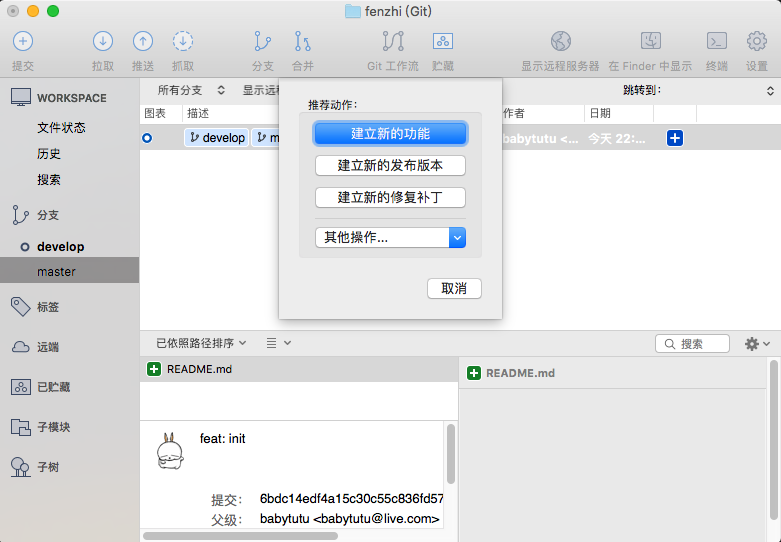


#### 4.3.2 建立新的功能

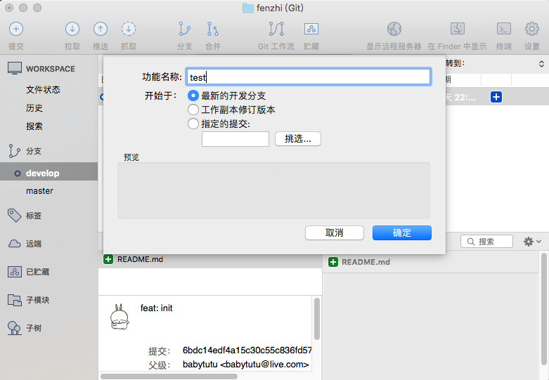

功能开发完毕后，在feature分支点击Git工作流后，出现如下提示

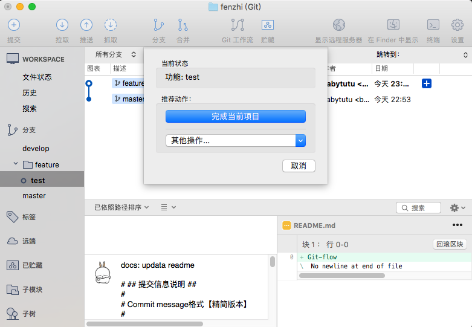

点击完成当前项目，出现提示，默认会在完成功能后删除`feature`分支，会自动进行分支合并

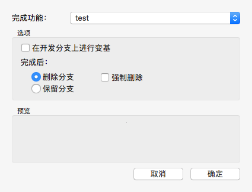

#### 4.3.3 建立新的发布版本

> 默认从develop分支新建

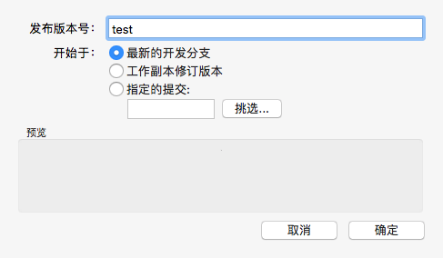

在release分支点击Git工作流后，出现如下提示

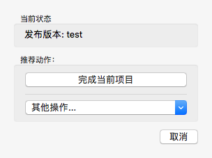

点击完成当前项目，会出现如下信息，需要给发布的版本打`tag`同时默认删除`release`分支

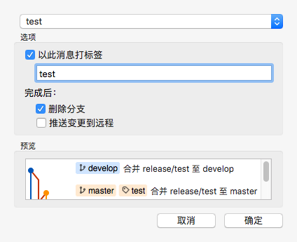

然后Git工作流会在master上打`tag`，并重新回到develop分支

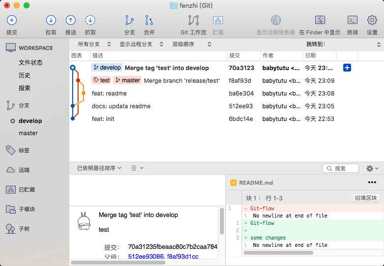


#### 4.3.4 建立新的修复补丁

> 人无完人，bug永无止境，很可能刚发布一个`tag`，就忽然发现一个重大问题需要紧急修复

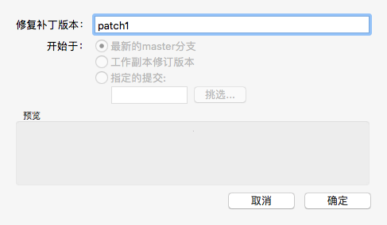

bug修复完毕后，在hotfix分支点击Git工作流后，出现如下提示

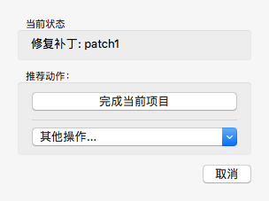

点击完成当前项目，会出现如下信息，需要给发布的补丁打`tag`同时默认删除`hotfix`分支

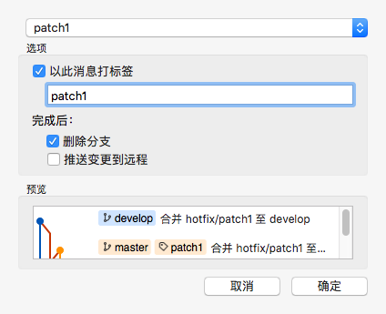

标准模式的Git flow会自动进行分支的新建删除，整个过程如下


### 4.4 代码维护

- 操作建议：多人协作开发项目，每次推送代码前，都执行拉取操作
- 巧用贮藏：拉取失败不要紧张，三步走：1、贮藏本地代码，2、拉取更新，3、应用贮藏
- 解决冲突：当发现有若干文件有冲突时，一定不能盲目合并代码，请和产生冲突的代码推送人一起解决

#### 4.4.1 提交代码

可以选择提交部分代码，将需要提交的代码加入`已暂存文件`，填写`提交信息`，点击提交即可

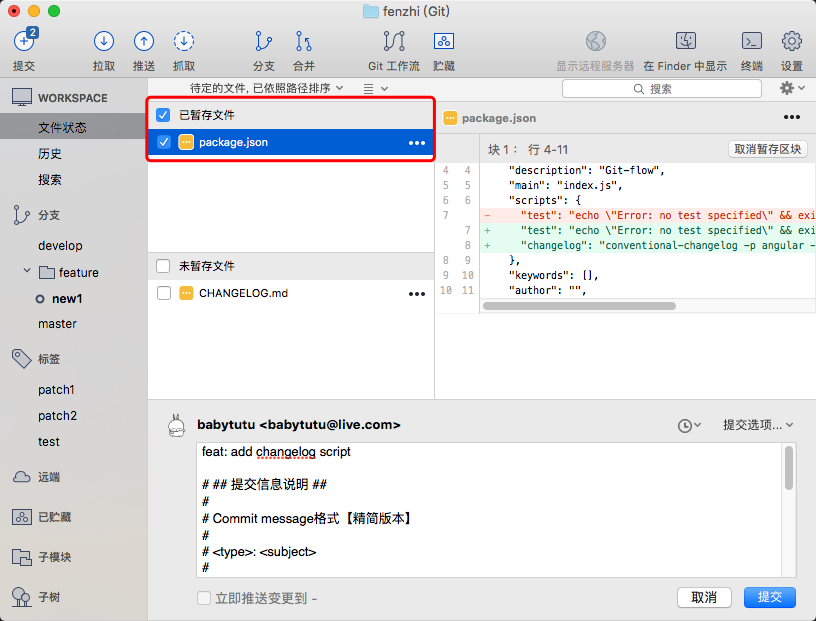

确认下，刚才的代码已经提交

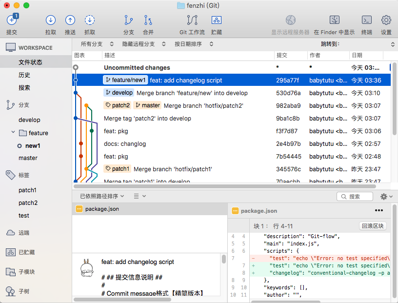


#### 4.4.2 贮藏代码

> 遇到无法推送的情况，git会提示需要先提交或者贮藏你的本地代码，这时候就用到了贮藏代码功能

可能会多次使用此功能，建议为每次操作都填写信息用于区分，可以勾选保留缓存的变更，那本地代码不会有变动，贮藏区域会把当前的变更保存，此选项默认是不勾选的

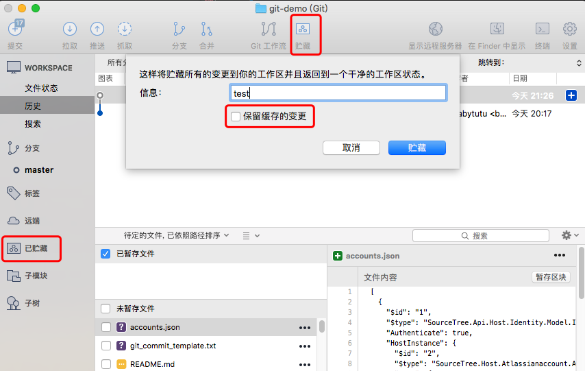

点击贮藏后，就恢复到了上一次提交，且`已贮藏`会显示保存的内容

> 特别说明：未加入版本管理的文件不会被贮藏

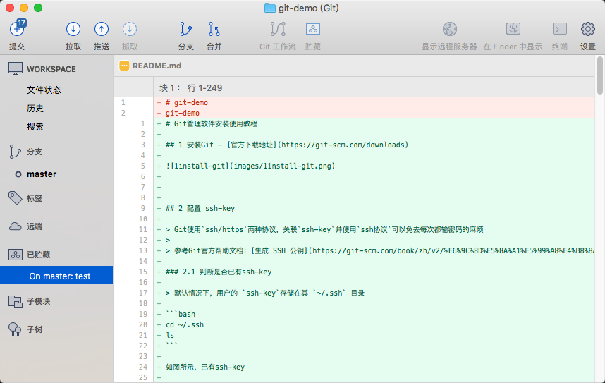

在`已贮藏`列表中选中需要应用的信息，右键，可以应用贮藏，会出弹窗确认此操作

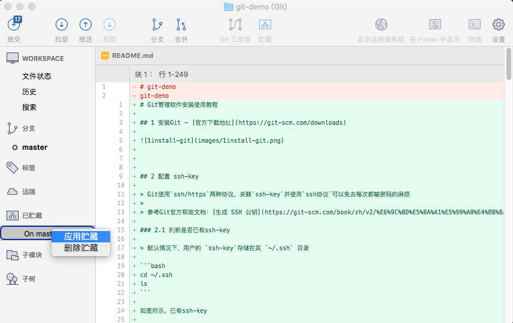


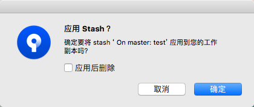

#### 4.4.3 遴选 cherry-pick

> 字面意思，就是我只要合部分代码

- 举个例子：开发过程中，`feature`分支提交了2个功能，如下图

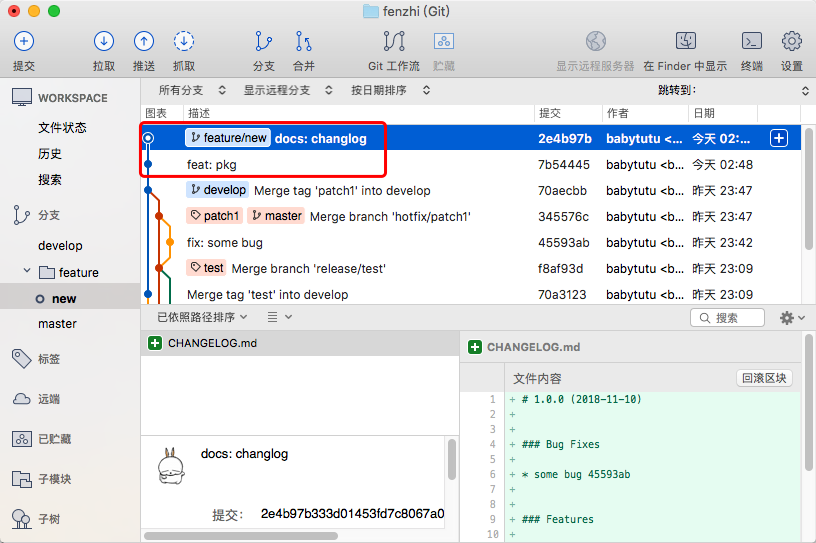

- 老板发话了，先把第一个新功能给客户，赶紧开个`hotfix`

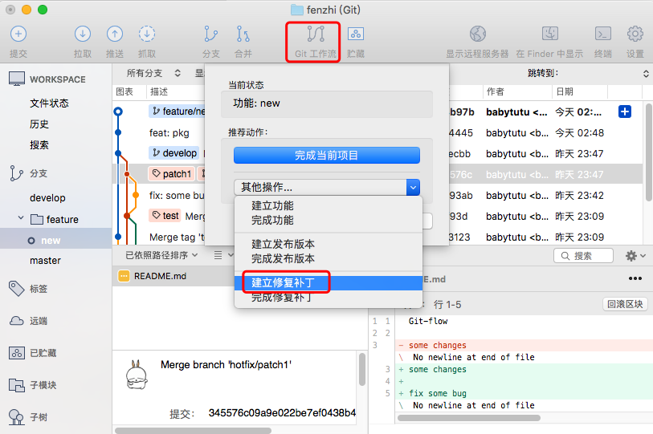


- 现在把第一个功能选中，然后`遴选`

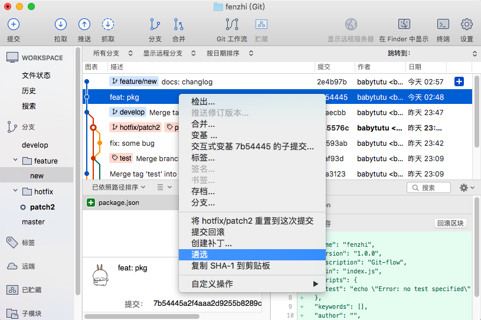


- 又要来和你确认了，真的要合么？我合了哟？

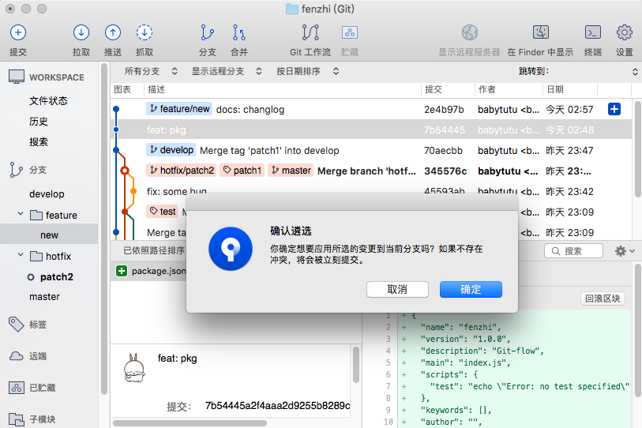


- 顺利合上去了

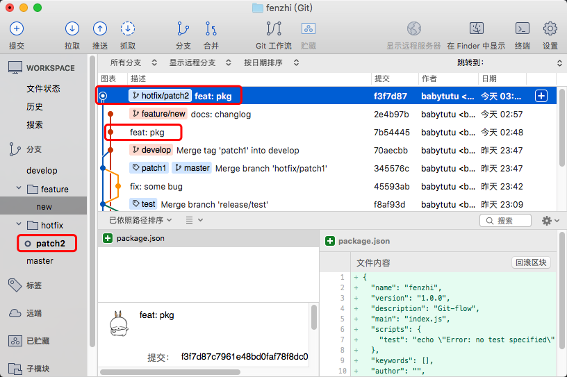

- 核对文件后，Git工作流走起来，客户就可以拿着patch2走了


- 接下去开发继续回到`feature`开发，全部开发完成后打tag，如下图

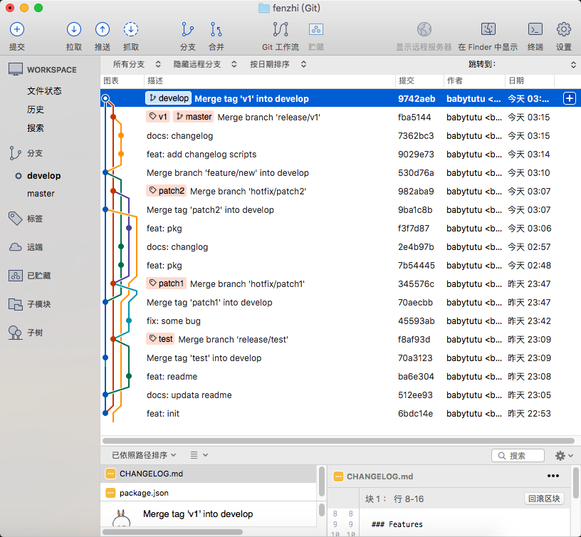


### 4.5 搜索

> 多维度搜素代码

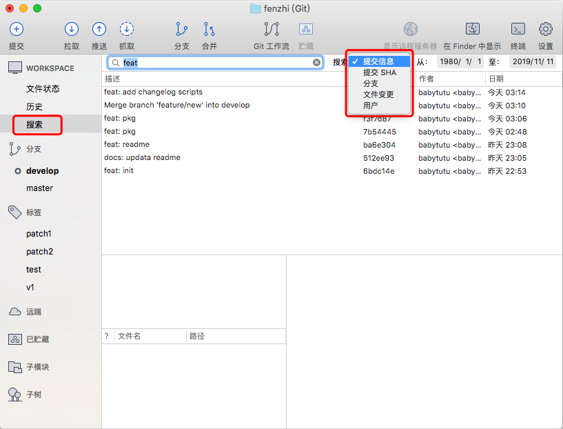


## 5 自动生成CHANGELOG

### 5.1 安装插件

```bash
npm install -g conventional-changelog-cli
cd my-project
conventional-changelog -p angular -i CHANGELOG.md -s
```

### 5.2 添加脚本

```package.json
"scripts": {
   "changelog": "conventional-changelog -p angular -i CHANGELOG.md -s -r 0"
 },
```

### 5.3 生成文件

```bash
npm run changelog
```


## 参考资料

- [git-book](https://git-scm.com/book/zh/v2)
- [Git Flow工作流程](https://www.jianshu.com/p/9a76e9aa9534)
- [Commit message 和 Change log 编写指南](http://www.ruanyifeng.com/blog/2016/01/commit_message_change_log.html)
- [conventional-changelog](https://github.com/conventional-changelog/conventional-changelog)

